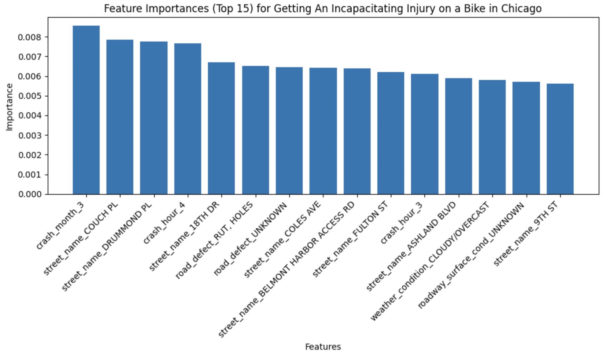
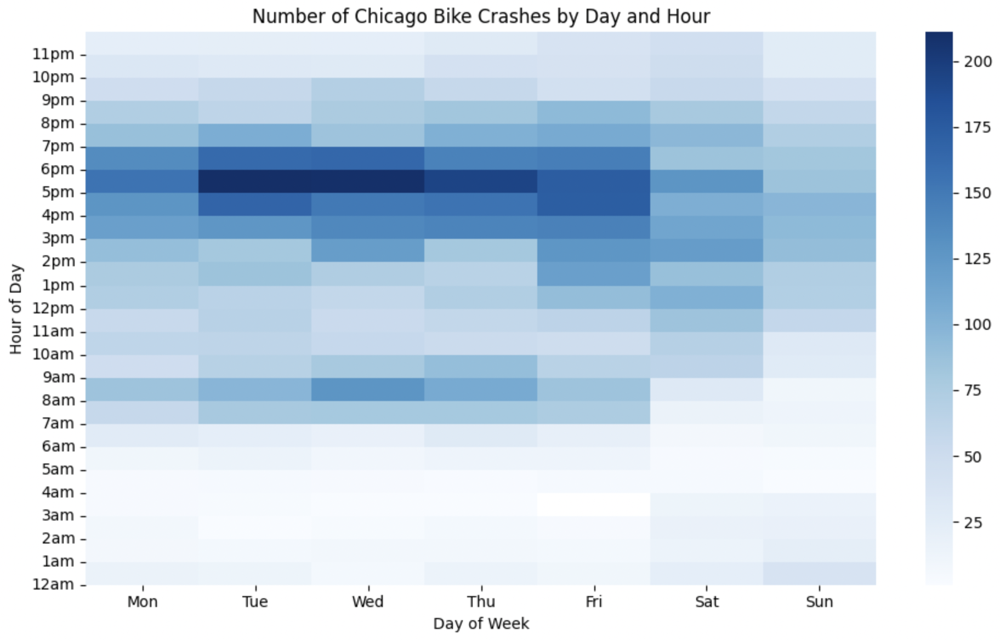
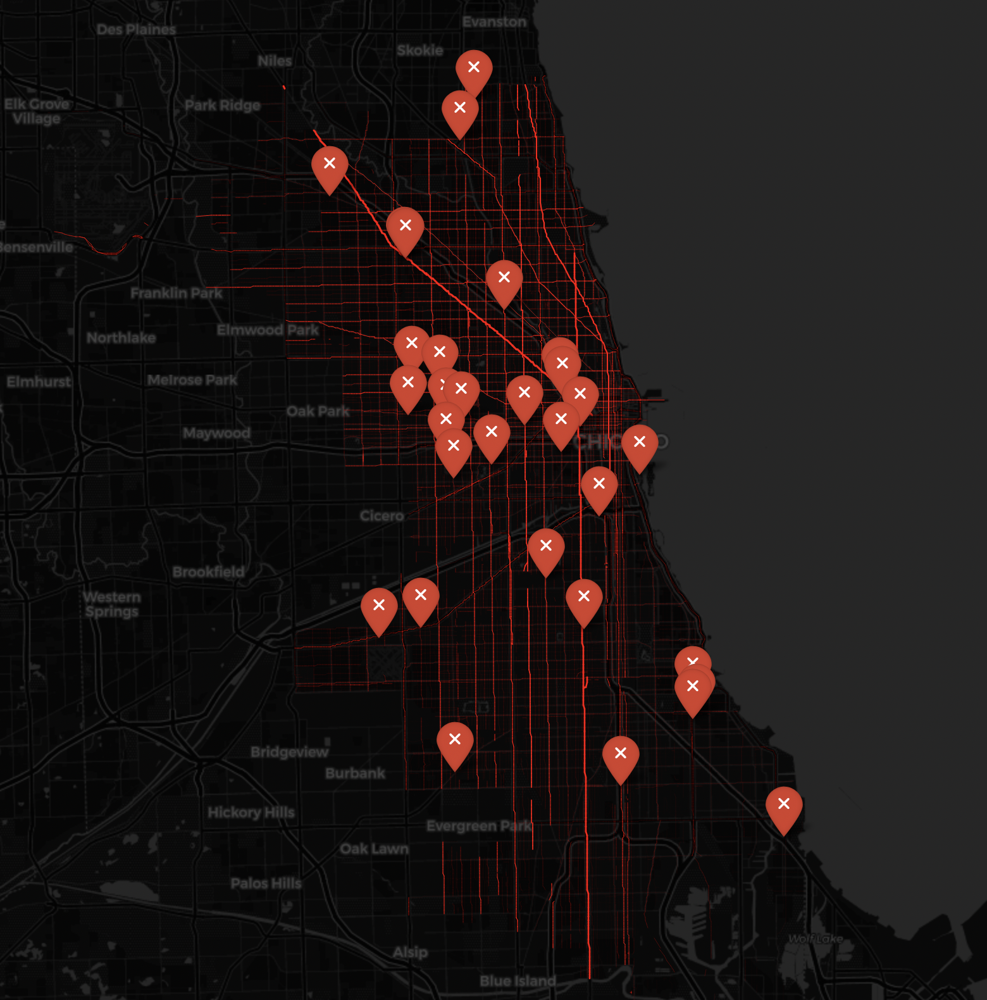
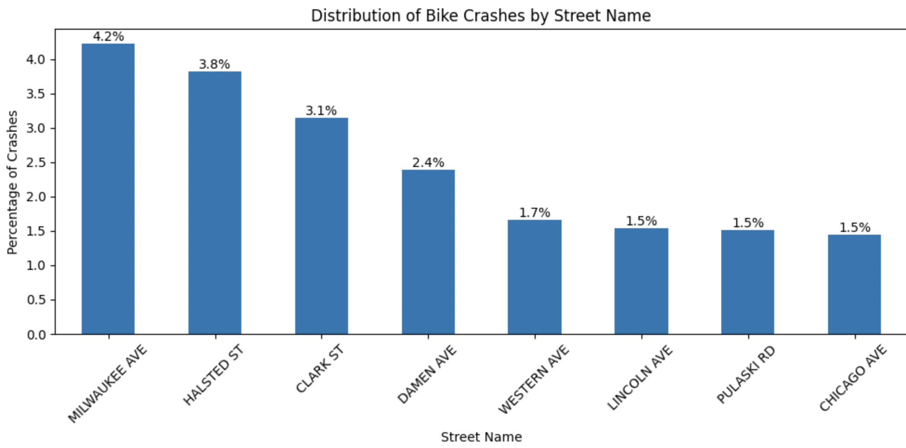
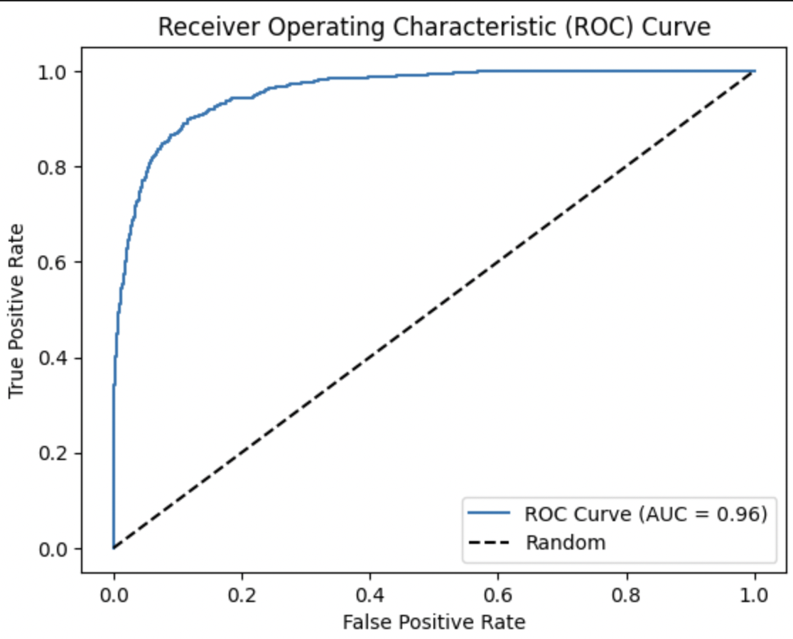

Chicago Bike Crashes Data Mining / Machine Learning Project
Objective
The objective of this data science project is to identify the variables that contribute to the most dangerous bike crashes in Chicago. By analyzing a dataset of reported bike crashes, we aim to uncover insights and patterns that can help improve bike safety measures in the city.

  

Dataset
The dataset used for this project was obtained from the City of Chicago public database of traffic accidents, available at https://data.cityofchicago.org/. The dataset consists of reported bike crashes that occurred in Chicago between 2016 and 2023.

Size: ~10,000 records
Format: CSV
Source: https://data.cityofchicago.org/resource/85ca-t3if.csv
Data Preprocessing and Cleaning
Prior to analysis, the following preprocessing and cleaning steps were performed on the dataset:

The target variable was created by combining bike crashes categorized as 'incapacitating' or 'fatal'.
Missing categorical values were imputed using the most frequent value.
Dates were split into separate columns for day, hour, and month.
Missing numerical values were imputed using the K-nearest neighbors (KNN) algorithm.
The numerical features were scaled to ensure comparability across different scales.
Main Features
The main features or variables in the dataset include:

Street name: The name of the street where the bike crash occurred.
Latitude/Longitude: The geographic coordinates of the crash location.
Weather condition: The prevailing weather condition at the time of the crash.
Time information: The day, hour, and month of the crash.
These features are relevant to the project objective as they help identify the factors associated with dangerous bike crashes in Chicago.

Exploratory Data Analysis (EDA)
Exploratory data analysis was conducted on the dataset, revealing the following insights and patterns:

Time and day show a strong relationship with many of the crashes.

  

A geojson file was downloaded to map out the most frequent bike crash locations and fatalities on an overlaid map of Chicago.
More deaths are concentrated on the west side of Chicago.

  

  

Machine Learning and Statistical Techniques
For analysis and prediction, a random forest model was trained using the dataset. The most important features from the model were then extracted to answer the leading question about the variables influencing dangerous bike crashes.

Evaluation Metrics
The performance of the random forest model was assessed using the following evaluation metrics:

F1 score: The model was optimized to achieve the best F1 score, which balances precision and recall.
Learning curve: The learning curve was plotted to evaluate the model's training and validation performance.
ROC curve: The ROC curve was used to assess the model's discriminatory power.

Data Split
The dataset was divided into training and testing sets using an 80/20 split ratio. Due to the heavy imbalance in the dataset (only 10% positive for the target variable), the random forest model incorporated balanced class weights. Additionally, the data split was stratified to include approximately equal amounts of the positive target variable in both the training and testing sets.

Programming Language and Tools
This data science project was implemented using Python.

Libraries and Packages
The following libraries and packages were utilized in this project:

scikit-learn (sklearn): Used for machine learning algorithms and evaluation metrics.
pandas: Used for data manipulation and analysis.
geopandas: Used for spatial data processing and visualization.
